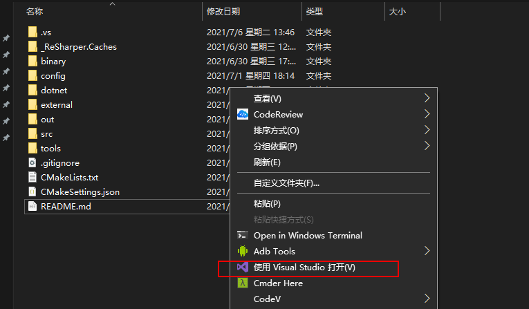
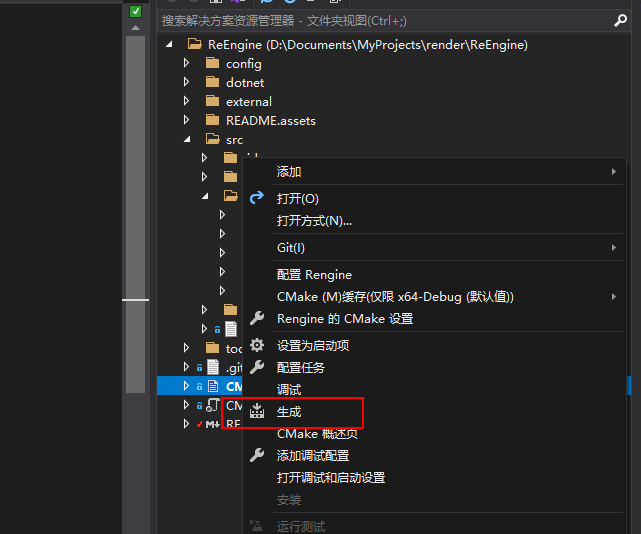

# Rengine引擎

## 目录结构

* binary ：二进制输出
* config : config
* dotnet : .net工程
* external ：外部工程
* out ：中间文件
* src ：源码目录
* tools ：工具目录

## 环境需求

* Cmake 3.17以上

* VS2019

* DotNet Core SDK 3.1
* Python3

## 使用方法

1. 直接右键打开CMake

   

2. 右键生成Cmake

   依赖将会自动生成：

   

